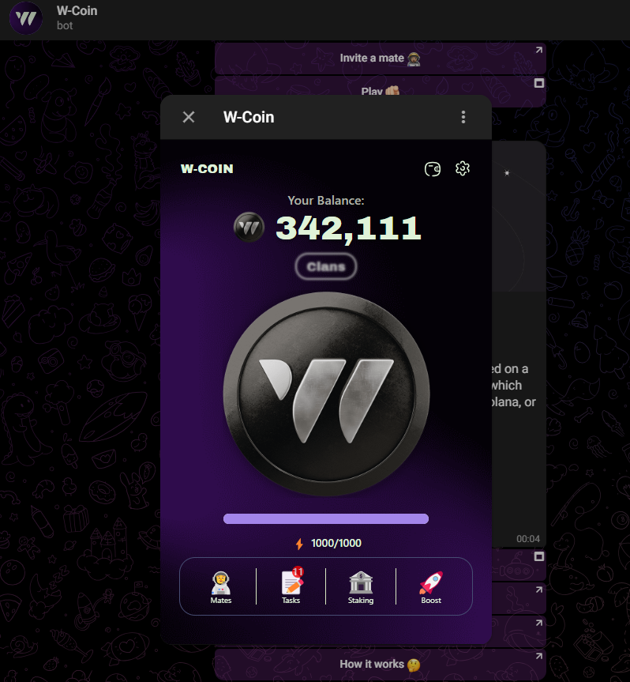

> [!NOTE]
> - Контакты: [Telegram](https://t.me/mudachyo) 
> - Канал: [Telegram Channel](https://t.me/shopalenka) 
> - 🇪🇳 README in english available [here](README-EN.md)
---
## How to run  
- Install extension in your browser [Violentmonkey](https://chromewebstore.google.com/detail/violentmonkey/jinjaccalgkegednnccohejagnlnfdag?hl=be)
- In order for W-Coin to open in a browser, install [этот скрипт](https://github.com/mudachyo/W-Coin/raw/main/w-coin-web.user.js)
- Open [Bot W-Coin](https://web.telegram.org/k/#?tgaddr=tg%3A%2F%2Fresolve%3Fdomain%3Dwcoin_tapbot%26start%3DMjQ3NTUyNg%253D%253D) and run the game

---
> [!TIP]
> Other repositories:
> 
> - [Hamster Kombat + Autoclicker](https://github.com/mudachyo/Hamster-Kombat)
> 
> - [TapSwap + Autoclicker](https://github.com/mudachyo/TapSwap)
> 
> - [Blum + Autoclicker](https://github.com/mudachyo/Blum)
>
> - [PixelTap + Autoclicker](https://github.com/mudachyo/PixelTap)
> 
> - [MemeFi + Autoclicker](https://github.com/mudachyo/MemeFi-Coin)
>
> - [Yescoin + Autoclicker](https://github.com/mudachyo/Yescoin)
>
> - [Gemz + Autoclicker](https://github.com/mudachyo/Gemz)
>
> - [Сrossfi + Autoclicker](https://github.com/mudachyo/Crossfi)
>
> - [BUMP](https://github.com/mudachyo/BUMP)
>
> - [W-Coin](https://github.com/mudachyo/W-Coin)
---
> [!IMPORTANT] 
> Donation
> 
> - [Donate](https://mudachyo.codes/donate/)
> 
> Donations will be used to maintain the project.
